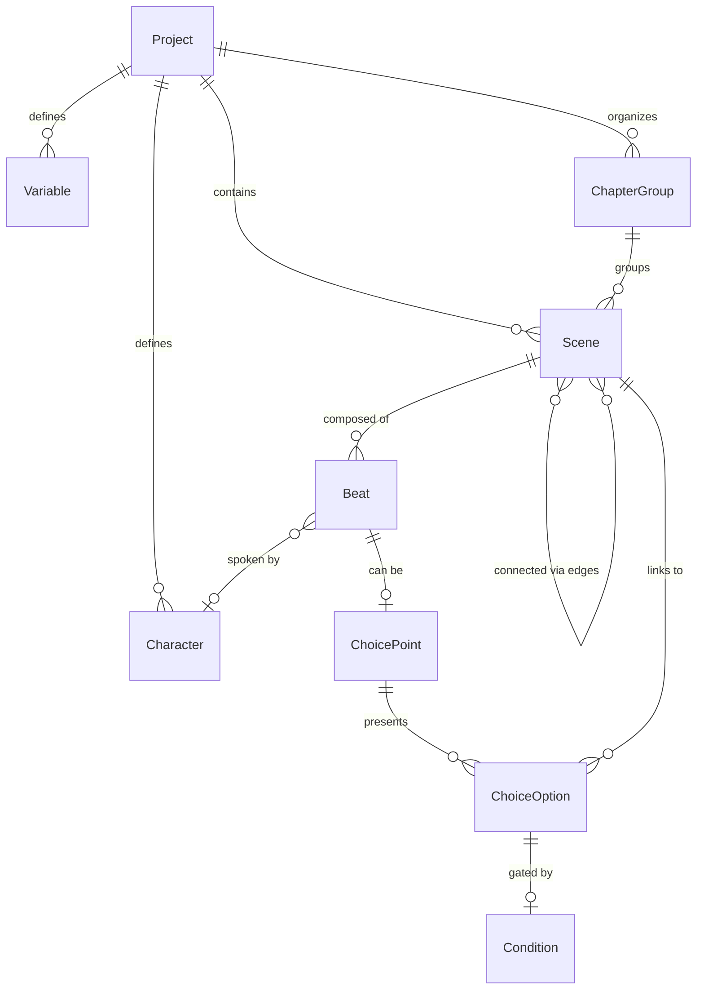
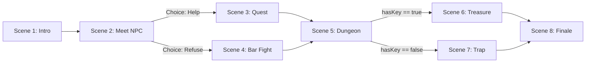
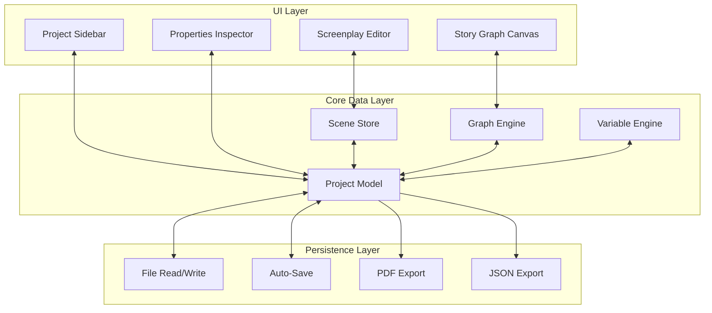

# Game Script Writer — Requirements and Feature Definition

## 1. Problem Statement

No single tool today combines **professional screenplay formatting** (scene headings, dialogue blocks, transitions, action lines) with **non-linear game narrative design** (branching choices, graph-based scene flow, light game logic). Writers working on interactive/game stories must juggle multiple tools (e.g. Final Draft + Twine + a spreadsheet for variables). This app unifies those workflows into one.

---

## 2. UI/UX Principles

The application must feel **clean, minimal, and focused** — in the spirit of Notion and Obsidian: content-first, low visual noise, and fast to work in.

### 2.1 Visual Style

- **Notion/Obsidian-like aesthetic**: Plenty of whitespace, subtle borders, restrained use of color. No heavy chrome or busy toolbars. Typography is clear and readable; UI elements are understated so the writing and the story graph take center stage.
- **Minimal chrome**: Sidebars and panels are thin and collapsible. Toolbars are contextual or hidden until needed. No cluttered ribbons or dense icon rows.
- **Consistent, soft palette**: Muted accents for interactive elements and graph nodes; avoid bright or garish highlights. Icons and controls should feel cohesive and lightweight.

### 2.2 Light and Dark Mode from the Start

- **First-class theming**: Light and dark themes are supported from day one, not as a later add-on. Both modes use the same layout and hierarchy; only colors and contrast change.
- **System-aware default**: The app respects the OS preference (light/dark) on first launch and allows the user to override it in settings.
- **Graph and editor**: The story graph, editor, and all panels look correct and readable in both themes (no hardcoded light-only or dark-only assumptions).

### 2.3 Simplicity for Scenes

- **Creating scenes**: Adding a new scene is a one- or two-step flow: e.g. a single button or shortcut, optional title, then the scene exists and is editable. No wizards or long forms. From the graph, "new scene" can be a single action (e.g. double-click empty space or a dedicated "+" control).
- **Visualizing scenes**: The story graph is the primary way to see structure. Opening it should be immediate (e.g. one click or shortcut). Nodes are easy to scan: scene title (and optionally a one-line preview) without information overload. Connecting scenes is a simple drag or click-to-link interaction; no need to open dialogs for basic linking.
- **Switching context**: Moving between "writing a scene" and "viewing the graph" (or the project tree) is fast and obvious — e.g. a slim sidebar or a clear toggle so the user never feels lost.

These principles apply to the MVP and all later phases; any new feature should fit this minimal, dual-theme, scene-simple approach.

---

## 3. Core Domain Concepts

These are the fundamental "nouns" of the application:

| Concept | Description |
| ------- | ----------- |
| **Project** | A single game/story. Contains all scenes, characters, variables, and the story graph. Saved as a single file (or folder). |
| **Scene** | The atomic unit of narrative. Each scene contains screenplay-formatted content (headings, dialogue, action, transitions). A scene is also a **node** in the story graph. |
| **Beat** | A sub-unit within a scene. Each screenplay element (scene heading, action, dialogue block, choice prompt) is a beat. Beats flow top-to-bottom within a scene. |
| **Choice Point** | A special beat type that presents branching options. Each option links to a different scene (or loops back). This is the bridge between the linear screenplay format and the non-linear graph. |
| **Character** | A named entity that speaks dialogue. Has metadata (name, short name, description, color for graph visualization). |
| **Variable** | A named piece of game state (boolean flag, integer counter, string). Can be set inside scenes and checked in conditions. |
| **Condition** | A logical expression attached to a choice option or scene transition (e.g. `hasKey == true`). Determines whether a path is available. |
| **Connection (Edge)** | A directed link between two scenes in the story graph. Can be unconditional (linear flow) or conditional (gated by a variable check). |
| **Chapter/Act** | An optional organizational grouping of scenes (for the writer's convenience, not necessarily visible to the player). |

### Concept Relationships

---

## 4. Feature Breakdown

### 4.1 Screenplay Editor (the writing surface)

This is where the writer spends most of their time. It should feel like a **focused, distraction-free text editor** with smart formatting — minimal UI, maximum writing space.

**Screenplay Element Types (auto-formatted):**

- **Scene Heading (Slugline)** — e.g. `INT. CASTLE THRONE ROOM - NIGHT`. Auto-capitalizes, distinct style.
- **Action** — Descriptive prose. Default element type.
- **Character Cue** — The name above a dialogue block. Auto-capitalizes, centered.
- **Dialogue** — The spoken text under a character cue. Indented/centered.
- **Parenthetical** — Stage direction within dialogue, e.g. `(whispering)`.
- **Transition** — e.g. `CUT TO:`, `FADE IN:`. Right-aligned, auto-capitalizes.
- **Choice Prompt** — *Game-specific element*. Presents branching options inline in the script. Visually distinct (perhaps a card/block UI). Each option shows label + target scene + optional condition.

**Editor behaviors:**

- Tab/Enter cycles between element types intelligently (e.g. after Character Cue, next element is Dialogue).
- Autocomplete for character names (from the project's character database).
- Keyboard shortcuts to force element type (Ctrl+1 for Scene Heading, Ctrl+2 for Action, etc.).
- Inline annotations/comments (writer notes that are not part of the exported script).
- Word/page count.
- Search and replace across the project.

### 4.2 Story Graph (the structure view)

A visual, node-based representation of the entire story flow — **simple to open, simple to read, simple to edit**. Minimal node design (title + optional one-line preview); connections are easy to create and follow. Fits the clean, Notion/Obsidian-like look in both light and dark mode.

**Graph features:**

- Each scene is a **node** (shows scene title, a small preview/summary, and its chapter color).
- **Edges** show connections between scenes. Choice-based edges show the choice label. Conditional edges show the condition.
- Drag-and-drop to rearrange node positions (layout is saved per-project).
- Auto-layout options (hierarchical top-down, left-right, force-directed).
- Zoom and pan. Mini-map for large graphs.
- Double-click a node to open that scene in the editor.
- Right-click context menu: create new scene, link scenes, delete, duplicate.
- Create new connections by dragging from one node's output port to another node's input port.
- Visual indicators: color-coded by chapter/act, icons for scenes that have unresolved dead-ends (no outgoing connections), highlight the "critical path."
- **Filtering**: show/hide scenes by chapter, by character presence, by variable usage.

### 4.3 Variables and Light Logic

**Variable management panel:**

- Define variables with name, type (boolean, integer, string), and default value.
- See where each variable is read/written across the project (cross-references).

**Setting variables in scenes:**

- A special "Set Variable" beat type (or inline directive) that modifies state. E.g. `[SET hasKey = true]`.
- Could be shown as a small inline widget in the editor.

**Conditions on choices/edges:**

- Each choice option or scene connection can have an optional condition expression.
- Simple expression syntax: `variableName == value`, `counter > 5`, `NOT hasItem`, `flagA AND flagB`.
- The condition is displayed both in the editor (on the choice) and on the graph edge.

### 4.4 Character Database

- List of all characters in the project.
- Fields: full name, short name (used in cues), description, optional avatar/color.
- Auto-populated from dialogue cues (if you write a new name, it gets added).
- Used for autocomplete in the editor and for filtering in the graph.

### 4.5 Project Structure Panel (sidebar)

- **Tree view** of the project:
  - Chapters/Acts (collapsible groups)
    - Scenes (ordered within a chapter, but the graph defines actual flow)
  - Characters
  - Variables
- Drag to reorder scenes within chapters.
- Quick navigation: click a scene to open it in the editor and highlight it in the graph.

### 4.6 Dual-View Layout

The app should support at least these layout modes:

- **Editor only** — Full-screen writing mode.
- **Graph only** — Full-screen story structure view.
- **Split view** — Editor on one side, graph on the other. Clicking a node in the graph navigates the editor. Writing a choice in the editor updates the graph in real-time.

### 4.7 Export and Output

- **PDF screenplay export** — Standard screenplay format (Courier 12pt, proper margins, page breaks). Only exports the content of scenes, following a selected path or all scenes in chapter order.
- **Plain text / Fountain format export** — Interoperable with other screenplay tools.
- **JSON/custom format export** — Machine-readable export of the full story graph + content, suitable for feeding into a game engine.
- **Print preview** — See the screenplay-formatted output before exporting.

### 4.8 File/Project Management

- Each project is a single file (e.g. `.gscript` or `.storyproject`) — likely a JSON or SQLite-based format under the hood.
- Auto-save with undo/redo history.
- Recent projects list on startup.
- Backup/versioning: periodic snapshots or integration with git for version control.

---

## 5. Key UX Flows

### Flow 1: Writing a Linear Scene

1. Open project, navigate to scene in sidebar or graph.
2. Editor opens. Start typing — default is Action element.
3. Press Tab or shortcut to switch to Character Cue. Type character name (autocomplete suggests).
4. Press Enter — automatically switches to Dialogue. Type dialogue.
5. Press Enter twice — back to Action.
6. Type a transition like `CUT TO:` — auto-detected and formatted.

### Flow 2: Creating a Branching Choice

1. Inside a scene, insert a Choice Point beat (via shortcut or menu).
2. A choice UI block appears in the editor with option slots.
3. For each option: type the choice label (what the player sees), select or create the target scene, optionally add a condition.
4. The graph view updates in real-time, showing new edges from this scene to the target scenes.

### Flow 3: Designing Story Structure Graph-First

1. Open graph view.
2. Right-click canvas to create new scene nodes. Name them.
3. Drag connections between nodes to define flow.
4. Double-click a node to open it in the editor and write its content.
5. Edges created in the graph automatically create placeholder choice points in the source scene.

---

## 6. Architecture Layers (Conceptual, Not Code)

---

## 7. Resolved Design Decisions

The following decisions are locked in for implementation.

### 1. Editor Technology: TipTap (ProseMirror)

- **TipTap** with its React integration (`@tiptap/react`).
- Provides structured document editing with custom node types — suitable for screenplay element blocks (scene heading, dialogue, action, parenthetical, transition) and game-specific blocks (choice point, set-variable directive).
- Rich extension system for autocomplete, keyboard shortcuts, and slash commands (Notion-style).
- Good theming support (light/dark mode via CSS).

### 2. Graph Library: React Flow

- **React Flow** (`@xyflow/react`, the v12 package) for the story graph.
- Built-in zoom/pan, minimap, custom node/edge rendering, drag-to-connect.
- Clean, minimal default look that fits the Notion/Obsidian aesthetic.
- Auto-layout via the `dagre` or `elkjs` plugin.

### 3. Frontend Framework: React

- **React** with TypeScript.
- First-class integration with both TipTap (`@tiptap/react`) and React Flow.
- State management via Zustand (lightweight, minimal boilerplate).
- Styling via CSS Modules or Tailwind CSS (for rapid, consistent theming with light/dark mode).

### 4. File Format: Single JSON File

- Each project is a single `.gscript` JSON file.
- Contains all scenes, characters, variables, graph layout positions, and metadata.
- Simple to save, load, back up, and version with git.
- Sufficient for projects up to ~500 scenes.

### 5. Fountain Compatibility: Custom JSON AST (Fountain export as optional later)

- Internal data model is a custom JSON AST (not Fountain-based).
- Each scene stores its beats as an ordered array of typed objects (scene-heading, action, character-cue, dialogue, parenthetical, transition, choice-point, set-variable).
- Fountain export can be added as a "best effort" converter in Phase 2 or later — it would strip game-specific elements and output standard screenplay text.

### 6. Playtest/Preview Mode: Phase 2

- Not in the MVP. Phase 1 focuses on the editor and graph.
- Phase 2 adds a simple "play through" panel: displays scene text, presents choices as clickable buttons, tracks variables, follows the graph. Minimal UI, read-only.

---

## 8. Tech Stack Summary

| Layer | Choice |
| ----- | ------ |
| App shell | Electron |
| Renderer | React + TypeScript |
| Screenplay editor | TipTap / ProseMirror |
| Story graph | React Flow |
| State management | Zustand |
| Styling / theming | Tailwind CSS or CSS Modules |
| Project persistence | Single `.gscript` JSON file |

---

## 9. MVP vs. Full Vision

### MVP (Phase 1)

- **Tech stack**: React + TypeScript, TipTap (editor), React Flow (graph), Zustand (state), single `.gscript` JSON file. Playtest is not in Phase 1.
- **UI**: Clean, minimal Notion/Obsidian-like interface; light and dark mode supported from the start. Simple scene creation and graph visualization (one-click new scene, clear graph view, easy linking).
- Screenplay editor with basic element types (scene heading, action, character, dialogue, parenthetical, transition).
- Choice point element in the editor.
- Story graph view with nodes and edges.
- Bidirectional sync: editor changes update graph, graph changes update editor.
- Simple variable system (boolean flags, set/check).
- Project save/load (JSON file).
- Basic PDF export.

### Phase 2

- Playtest/preview mode (simple "play through" panel: scene text, clickable choices, variable tracking).
- Character database with autocomplete.
- Conditions on edges (light logic expressions).
- Graph filtering and search.
- Split-view layout.
- Fountain export (best-effort).
- Auto-layout algorithms for the graph.

### Phase 3

- JSON export for game engines.
- Undo/redo with full history.
- Theming (dark mode, custom editor themes).
- Collaboration features (optional, low priority).

---

## 10. Non-Functional Requirements

- **Performance**: Should handle projects with 200+ scenes and 500+ edges without lag in the graph view.
- **Offline-first**: Everything works locally, no server dependency.
- **Cross-platform**: Electron gives Windows, macOS, Linux support.
- **Data safety**: Auto-save, crash recovery, no silent data loss.
- **Accessibility**: Keyboard-navigable editor is a MUST, screen reader support for core workflows.
- **Visual design**: Minimal UI and dual theme (light/dark) are non-negotiable from the first release; no "we'll add dark mode later."
